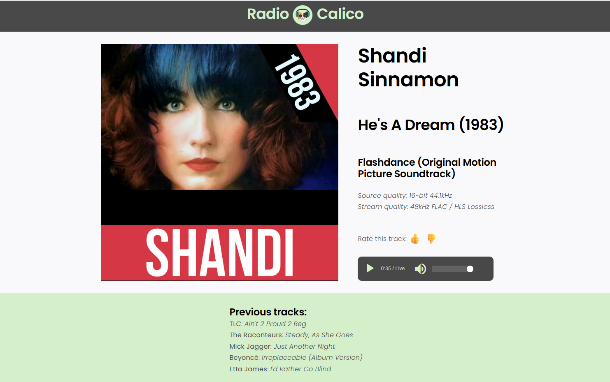

# Radio Calico

A web player for Radio Calico's lossless HLS stream, with a thumbs up/down
rating for the track that's playing.


One page, one station. A **Now Playing** card carries the album art, artist,
track, album, source/stream quality and the transport controls; a full-bleed
**Recently Played** band below it lists the last five tracks.



<sub>`RadioCalicoLayout.png` — the design reference this UI is built to, not a
screenshot.</sub>

## Features

- **Lossless by default.** The master playlist offers FLAC and AAC variants;
  the player pins FLAC rather than letting adaptive bitrate choose.
- **Live track metadata**, polled every 10s, including the source's bit depth
  and sample rate.
- **Cover art that doesn't flash.** The next image is decoded off-screen and
  swapped in only once it's ready.
- **Thumbs up/down per track**, tallied across listeners in Postgres, one vote
  per browser, no sign-in.
- **Volume that persists** across reloads without a hydration mismatch.
- **Health endpoint** for checking database wiring.

## Requirements

- **Node.js 20.9+** (developed on 24.x)
- **Docker** — for Postgres and Adminer

## Quick start

```bash
git clone https://github.com/simba84-cloud/radio.git
cd radio
npm install
cp .env.example .env.local   # first time only
npm run db:up                # start Postgres + Adminer
npm run dev                  # start Next.js on :3002
```

Open <http://localhost:3002>. Check the wiring at
<http://localhost:3002/api/health> — it should return
`{"ok":true,"db":"up",...}`.

### Ports

Non-default ports are deliberate: 3000, 5432 and 8080 were already taken on the
machine this was built on.

| Service    | URL                     |
| ---------- | ----------------------- |
| Web app    | http://localhost:3002   |
| Adminer UI | http://localhost:8081   |
| Postgres   | `localhost:55432`       |

### Scripts

| Command            | Does                                              |
| ------------------ | ------------------------------------------------- |
| `npm run dev`      | Next.js dev server on :3002                       |
| `npm run build`    | Production build                                  |
| `npm run start`    | Serve the production build                        |
| `npm run lint`     | ESLint (flat config)                              |
| `npm run typecheck` | `tsc --noEmit`                                   |
| `npm test`         | Run every test project once                       |
| `npm run test:watch` | Vitest in watch mode                            |
| `npm run test:coverage` | Coverage report (thresholds on `lib/`)       |
| `npm run db:test:create` | Create the `radio_test` database             |
| `npm run db:up`    | Start Postgres + Adminer                          |
| `npm run db:down`  | Stop them (data is kept)                          |
| `npm run db:psql`  | Open a `psql` shell                               |
| `npm run db:reset` | **Destroy the volume** and re-run `db/init/*.sql` |

## API

### `GET /api/health`

Database connectivity check. `200` with `{"ok":true,"db":"up","now":...}`, or
`503` with a described error when the query fails.

### `GET /api/ratings?artist=…&title=…`

Current tally for a track, plus the caller's own vote.

```json
{ "up": 42, "down": 3, "mine": 1 }
```

`mine` is `1`, `-1`, or `null` if this browser hasn't voted. `400` if `artist`
or `title` is missing.

### `POST /api/ratings`

```json
{ "artist": "Led Zeppelin", "title": "Kashmir", "rating": 1 }
```

`rating` must be `1` or `-1`. Returns `201` with the updated tally and
`"accepted": true`. A repeat vote from the same listener — **including a change
of mind** — returns `409`, still with the current tally, so the UI can settle on
the truth rather than guess. Votes are final.

## Tests

```bash
npm run db:test:create   # once — creates the radio_test database
npm test
```

109 tests in three Vitest projects, split by what they need to run:

| Project  | What | Environment |
| -------- | ---- | ----------- |
| `unit`   | Pure functions — track identity, feed parsing, formatting | node |
| `db`     | Ratings invariants and route handlers, against real Postgres | node |
| `client` | Components and hooks | jsdom |

A file's name decides where it runs: **`*.db.test.ts` means it needs a
database**, wherever it sits in the tree.

**The DB tests use a real Postgres on purpose.** One-vote-per-listener is a
`UNIQUE` constraint rather than a read-then-write, so the interesting test is
whether two simultaneous votes from one listener produce exactly one row — and a
mocked `pg` client could only ever confirm the mock. Those tests run against a
separate `radio_test` database, and `test/setup-db.ts` refuses to start if
pointed anywhere else, since it truncates between tests.

Audio output is the one thing this suite can't cover. jsdom has no media stack,
so `HTMLMediaElement` and `MediaSource` are stubbed and hls.js is replaced by a
fake. That makes the *decisions* testable — which variant gets pinned, which
branch a browser takes, how fatal errors are handled — but nothing decodes.
Confirm actual playback by ear.

## How it works

### Streaming

The stream is `https://d3d4yli4hf5bmh.cloudfront.net/hls/live.m3u8`. Its master
playlist offers two variants, FLAC (lossless) and AAC, and hls.js would
otherwise let adaptive bitrate pick between them by bandwidth. So
`app/components/use-hls-audio.ts` pins the FLAC level whenever Media Source
Extensions can decode it (`audio/mp4; codecs="flac"`), falling back to AAC where
they can't. Safari/iOS get native HLS instead, which decodes FLAC-in-HLS
themselves.

Two things worth knowing before changing that file:

- **Try `Hls.isSupported()` before `canPlayType`.** Chrome answers `"maybe"` to
  `canPlayType("application/vnd.apple.mpegurl")` but cannot actually play it, so
  probing native support first silently sends Chrome down a path that never
  plays. The hls.js path is also the only one that can pin the lossless variant.
- **Keep `preload="auto"` on the `<audio>` element.** hls.js feeds it through a
  MediaSource, and `"none"` can stop that source from ever opening.

### Metadata and cover art

Track info comes from the station's `metadatav2.json`, polled every 10s. Its
`bit_depth` / `sample_rate` describe the *source*, which is often
higher-resolution than the delivered stream.

Cover art is a single URL whose bytes change per track, so it's cache-busted
with a track-keyed query parameter and fetched once per song, never retried —
safe only because the station writes `cover.jpg` about 2.6s *before* it flips
the metadata. `use-stable-image.ts` decodes the incoming image off-screen and
swaps the visible `src` only when it's ready; assigning `src` directly drops the
old bitmap and blanks the frame for over a second.

### Ratings

Two constraints shape the design:

- **Songs have no id.** The feed gives only artist and title, so a track's
  identity is a normalized, JSON-encoded `[artist, title]` pair
  (`trackRatingKey` in `lib/ratings.ts`). Normalizing is not cosmetic — the feed
  ships incidental double spaces (`"Kashmir  (Remaster)"`) that would otherwise
  split one song's tally across two keys. The pair is JSON-encoded rather than
  joined with a separator so that an artist or title containing the separator
  can't collide with a different pair.
- **Listeners have no accounts.** One vote per listener is pinned to an opaque
  uuid in an httpOnly `rc_listener` cookie. That identifies a *browser*, not a
  person: clearing cookies or switching browsers earns another vote. Without
  sign-in that's the honest ceiling, so don't read the totals as unique people.

The single vote is enforced by the `track_ratings_one_vote_per_listener` unique
constraint plus `on conflict do nothing` — not by a read-then-write in the
route, which under concurrent clicks would let two votes through.

## Database

Credentials are `radio` / `radio`, database `radio` — local only, see
`docker-compose.yml`. Log into Adminer with system **PostgreSQL**, server
**postgres**, and those credentials.

`db/init/*.sql` runs once, in filename order, **when the volume is first
created**. Editing those files does nothing to an existing database. Either
`npm run db:reset` (destroys data) or apply the change by hand:

```bash
docker exec -i radio-postgres psql -U radio -d radio -v ON_ERROR_STOP=1 \
  < db/init/003_ratings.sql
```

`track_ratings` holds the votes. The `stations` table is leftover placeholder
scaffolding that nothing reads yet.

## Project layout

```
app/               routes and pages
  components/      NowPlaying + RecentlyPlayed widgets, player bar,
                   rating buttons, and the hls.js / metadata hooks
  api/health/      DB connectivity check
  api/ratings/     read and cast thumbs up/down votes
lib/radio.ts       stream URLs and metadata helpers
lib/ratings.ts     track identity + rating queries
lib/db.ts          pooled pg client + query() helper
db/init/           SQL run on first database creation
test/              vitest setup: DB harness and jsdom media stubs
vitest.config.mts  the three test projects
docker-compose.yml Postgres + Adminer
```

## Design

Layout and finish follow `RadioCalicoLayout.png`; the brand system
(`RadioCalico_Style_Guide.txt`) supplies the palette, the Montserrat/Open Sans
pairing and the type scale, which live as Tailwind `@theme` tokens in
`app/globals.css`. `RadioCalicoLogoTM.png` is both the nav mark and the app icon.

Measurements were sampled from the mockup rather than eyeballed: a 75px
`#494949` bar, a `#f9f9fb` page ground, a ~960px content column split 1.72:1
between art and details across a 48px gutter, and a 330x59 dark player pill with
a `#626262` fill and white thumb.

**The two sources disagree in places, and the mockup wins.** Where a choice
looks like it contradicts the style guide, this is why:

| Element | Style guide | Mockup (in use) |
| --- | --- | --- |
| Nav bar | Teal | Graphite `#494949` |
| Hero | Dark photo + "Listen Now" | No hero |
| Audio controls | Charcoal icons on cream | White icons on dark |
| Volume fill | Teal | Grey `#626262` |
| Content width | 1200px | ~960px |
| Page ground | White | `#f9f9fb` |
| Buttons | 4px border, 2px outline | Bare thumb glyphs for rating |

The guide's logo clear space (50% of the diameter) also can't hold in a 75px bar
around a 56px mark, so the nav is tighter than §1 asks. There is no footer — the
mockup ends at the mint band.

## Development notes

Run `npm test` (Vitest). The suite is in three projects — `unit` for pure
functions, `db` for the ratings invariants against a real Postgres, `client` for
components and hooks in jsdom. See [Tests](#tests) above.

Also available: `npm run typecheck` (`tsc --noEmit`) and `npm run lint`.

Audio playback can't be confirmed through browser-automation tooling, where
MediaSource is unavailable and the player takes the native path that never
plays. Check playback by hand, or assert on state and logs rather than sound.

## Notes on the stream

The audio stream, track metadata and cover art are served from Radio Calico's
CloudFront distribution; this repository contains the player only. The Radio
Calico name, logo and style guide are the station's brand assets, included here
for building against it, and are not covered by any license granted on this
code.

No `LICENSE` file has been added yet, so the code carries default copyright —
all rights reserved.
